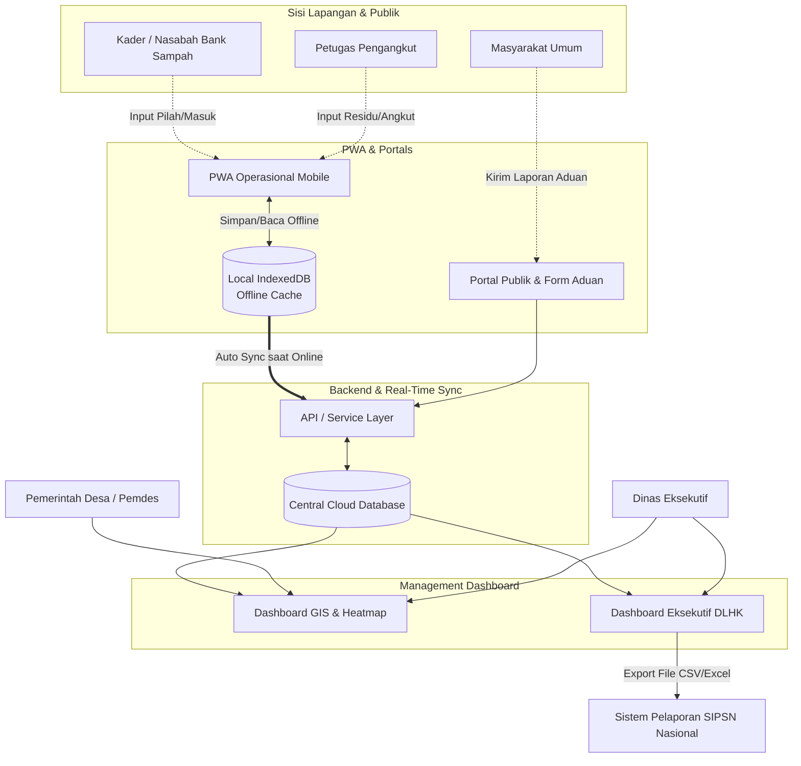
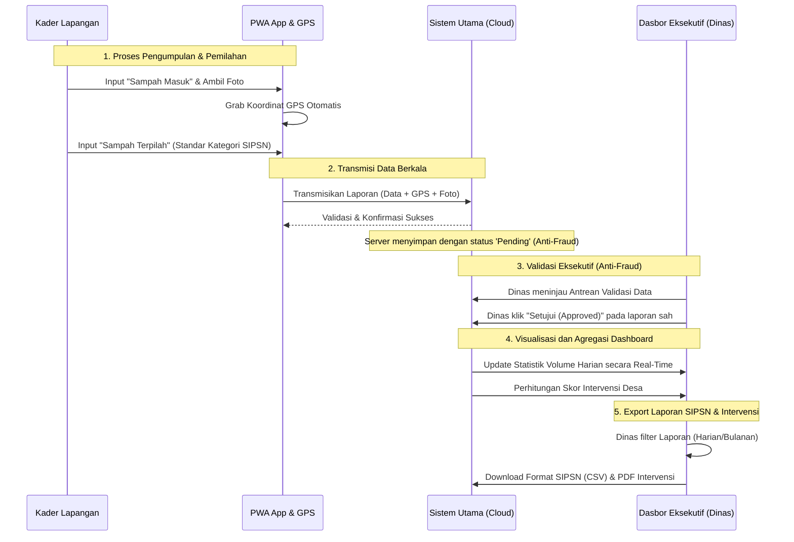

# Pemetaan Aliran Data Sistem SIMPAH

Sistem SIMPAH memiliki alur data yang dirancang mulai dari tingkat **sumber (lapangan/akar rumput)** hingga **tingkat eksekutif (Dinas)** sebagai bahan pengambilan keputusan berkelanjutan dan pelaporan SIPSN.

Untuk pemahaman terbaik tentang bagaimana semua komponen ini terhubung secara logis, saya menyarankan pendekatan gabungan antara:
1. **High-Level System Architecture:** Untuk melihat interaksi antar modul (PWA vs Dashboard vs Server).
2. **Data Flow Workflow (Alur Entri Data Operasional):** Untuk memetakan lifecycle / siklus perjalanan entri tunggal dari HP petugas ke laporan akhir.

---

## 1. Arsitektur Sistem (Level Makro)

Diagram arsitektur makro ini menunjukkan hubungan entitas atau modul utama aplikasi, bagaimana *offline-first* bekerja, dan siapa yang mengonsumsi data tersebut.

> [!NOTE]
> **Mengapa Arsitektur Ini Kuat?**
> Karena ada lapisan **Local IndexedDB (Offline Cache)**. Kader di pelosok yang tidak memiliki sinyal bisa tetap memasukkan data tanpa gagal. Begitu mendapat internet, Service API akan melakukan sinkronisasi dengan *Cloud Database* di *background*.

---

## 2. DFD Alur Operasional Pengelolaan Sampah (Level Mikro)

Bagaimana perjalanan sampah (data fisik) dipetakan ke dalam entri data digital dari hulu hingga hilir pelaporan?

> [!TIP]
> **Fokus Utama Pemetaan Form (SIPSN Compliance):**
> Titik kritis dari DFD operasional di atas terletak di Form Entri Data. Data sampah terpilah (Contoh: "Plastik: 5kg", "Sisa Makanan: 2kg") langsung diformat oleh PWA mengikuti standar klasifikasi **SIPSN**. Ini menghilangkan keharusan pihak Dinas atau Operator Desa untuk merekap ulang data kotor.

---

## Kesimpulan Rekomendasi
Untuk Anda atau saat Anda melakukan presentasi/pitching, saya menyarankan untuk memakai **High-Level System Architecture (Diagram 1)** dikombinasikan dengan narasi dari **Sequence DFD (Diagram 2)**. 

Diagram Arsitektur Makro secara visual dengan cepat menunjukkan nilai jual (value proposition) yang tinggi, yaitu integrasi data dari skala terbawah *(PWA)*, berpusat ke sistem tangguh dan offline-first, diteruskan ke *(Cloud)* terpusat, dan bermuara ke modul analitik canggih bagi aparat eksekutif *(Dashboard GIS & Automasi Ekspor Pelaporan SIPSN)*.
