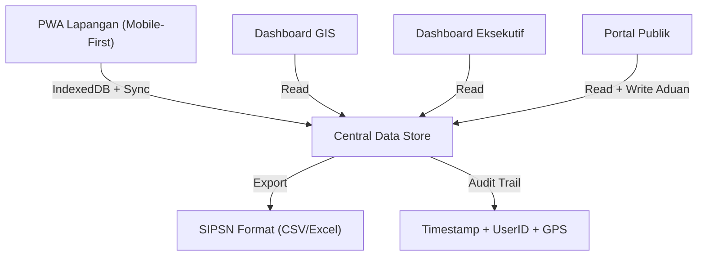
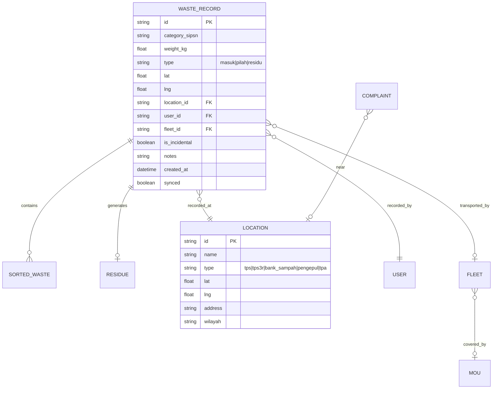

# SIMPAH - Implementation Plan
## Sistem Informasi Monitoring Pengelolaan Sampah

> [!IMPORTANT]
> This is a **front-end prototype** built as a PWA with simulated backend using IndexedDB + localStorage. A real production deployment would require a proper backend (Node.js/Python), but this prototype demonstrates the full UI/UX, offline-first architecture, and all core workflows.

---

## Architecture Overview



## Tech Stack

| Layer | Technology | Rationale |
|-------|-----------|-----------|
| Build Tool | **Vite** | Fast HMR, PWA plugin, optimal for low-bundle apps |
| UI | **Vanilla JS + CSS** | Lightweight, no framework overhead for low-end devices |
| PWA | **vite-plugin-pwa (Workbox)** | Service worker, offline caching, install prompt |
| Maps/GIS | **Leaflet.js** | Lightweight (~40KB), works offline with tile caching |
| Charts | **Chart.js** | Small footprint, responsive charts |
| Offline DB | **IndexedDB (via idb)** | Structured offline storage with good mobile support |
| Icons | **Lucide Icons** (inline SVG) | Lightweight icon system |
| Export | **SheetJS (xlsx)** | Client-side Excel/CSV export for SIPSN |
| Fonts | **Inter** (Google Fonts) | Clean, modern, great readability |

## Project Structure

```
simpah/
├── index.html                    # App shell / entry point
├── vite.config.js                # Vite + PWA configuration
├── package.json
├── manifest.json                 # PWA manifest
├── public/
│   ├── icons/                    # PWA icons (192, 512)
│   ├── tiles/                    # Offline map tiles (optional)
│   └── sw.js                     # Service worker (generated)
├── src/
│   ├── main.js                   # App bootstrap & router
│   ├── router.js                 # Hash-based SPA router
│   ├── styles/
│   │   ├── index.css             # Design system & tokens
│   │   ├── components.css        # Reusable component styles
│   │   ├── dashboard.css         # Dashboard-specific styles
│   │   ├── pwa.css               # Mobile/field app styles
│   │   └── portal.css            # Public portal styles
│   ├── db/
│   │   ├── schema.js             # IndexedDB schema & migrations
│   │   ├── store.js              # Data access layer (CRUD)
│   │   ├── seed.js               # Demo/seed data generator
│   │   └── sync.js               # Offline sync simulation
│   ├── utils/
│   │   ├── gps.js                # Geolocation utilities
│   │   ├── audit.js              # Audit trail helper
│   │   ├── export.js             # SIPSN CSV/Excel export
│   │   ├── sipsn.js              # SIPSN waste categories
│   │   └── helpers.js            # Date, format, validation utils
│   ├── components/
│   │   ├── navbar.js             # Top navigation bar
│   │   ├── sidebar.js            # Dashboard sidebar
│   │   ├── bottom-nav.js         # Mobile bottom navigation
│   │   ├── toast.js              # Notification toasts
│   │   ├── modal.js              # Modal dialog
│   │   ├── card.js               # Metric/stat card
│   │   ├── chart-wrapper.js      # Chart.js wrapper
│   │   └── map-wrapper.js        # Leaflet map wrapper
│   ├── pages/
│   │   ├── login.js              # Login page (role-based)
│   │   ├── pwa/
│   │   │   ├── home.js           # PWA dashboard (field)
│   │   │   ├── input-sampah.js   # Waste input form
│   │   │   ├── input-pilah.js    # Sorted waste form
│   │   │   ├── input-residu.js   # Residue form
│   │   │   ├── armada.js         # Fleet/vehicle input
│   │   │   ├── insidental.js     # Incidental events
│   │   │   └── riwayat.js        # History/records
│   │   ├── dashboard/
│   │   │   ├── gis.js            # GIS Map dashboard
│   │   │   ├── eksekutif.js      # Executive dashboard
│   │   │   ├── mou.js            # MoU management
│   │   │   └── laporan.js        # Reports & export
│   │   └── portal/
│   │       ├── beranda.js        # Public home
│   │       ├── edukasi.js        # Education articles
│   │       ├── galeri.js         # Activity gallery
│   │       ├── regulasi.js       # Regulations
│   │       └── aduan.js          # Public complaint form
│   └── assets/
│       └── logo.svg              # SIMPAH logo
```

---

## Proposed Changes

### Phase 1: Foundation & PWA Setup

#### [NEW] package.json
- Vite project with PWA plugin, Leaflet, Chart.js, idb, xlsx dependencies
- Scripts: `dev`, `build`, `preview`

#### [NEW] vite.config.js  
- PWA configuration with Workbox
- Offline caching strategies (CacheFirst for assets, NetworkFirst for data)
- Auto-register service worker

#### [NEW] index.html
- App shell with minimal HTML
- Meta tags for mobile viewport, theme color
- PWA manifest link
- Loading skeleton

#### [NEW] src/styles/index.css
- CSS custom properties (design tokens):
  - Color palette: Deep emerald green (#0D7C3D) as primary, earth tones
  - Dark mode support via `prefers-color-scheme`
  - Typography scale using Inter font
  - Spacing, radius, shadows
  - Animation keyframes
- Glassmorphism utility classes
- Responsive breakpoints (320px → 1440px)

#### [NEW] src/main.js & src/router.js
- Hash-based SPA router (#/pwa/home, #/dashboard/gis, etc.)
- Route guards (role-based access)
- Page transition animations

---

### Phase 2: Data Layer & PWA Field Module

#### [NEW] src/db/schema.js
- IndexedDB stores:
  - `waste_records` — sampah masuk (id, type, weight, category_sipsn, location, timestamp, user_id, synced)
  - `sorted_waste` — sampah terpilah (linked to waste_record)
  - `residue` — residu records
  - `fleet` — armada/kendaraan
  - `mou` — MoU records with status
  - `complaints` — aduan masyarakat
  - `locations` — TPS/TPS3R/Bank Sampah/TPA coordinates
  - `users` — user accounts with roles
  - `audit_log` — full audit trail

#### [NEW] src/db/seed.js
- Generate realistic demo data:
  - 50+ waste records across 30 days
  - 10 location points (TPS3R, Bank Sampah, TPA)
  - 5 user accounts (kader, petugas, bumdes, pengepul, dinas)
  - MoU records with varying statuses

#### [NEW] src/utils/sipsn.js
- SIPSN waste categories enum:
  - Sisa Makanan, Kayu/Ranting, Kertas/Karton, Plastik, Logam, Kain/Tekstil, Karet/Kulit, Kaca, Lainnya
- Category-to-code mapping for export

#### [NEW] src/pages/pwa/* (6 files)
- **home.js**: Quick-action grid (Sampah Masuk, Pilah, Residu, Armada, Insidental), sync status indicator, today's summary stats
- **input-sampah.js**: 
  - Large touch-friendly buttons
  - Auto GPS capture on form open
  - Category selector (SIPSN grid)
  - Weight input with unit toggle (kg/ton)
  - Photo capture (camera API)
  - Submit with offline queue
  - < 10 second input flow
- **input-pilah.js**: Multi-category weight breakdown
- **input-residu.js**: Residue recording with destination (TPA/other)
- **armada.js**: Vehicle plate/code input, driver assignment
- **insidental.js**: Event type selector, photo, notes, participant count

---

### Phase 3: GIS Dashboard

#### [NEW] src/pages/dashboard/gis.js
- Full-width Leaflet map with OpenStreetMap tiles
- Custom markers:
  - 🟢 TPS3R (green)
  - 🔵 Bank Sampah (blue)  
  - 🟡 Pengepul (yellow)
  - 🔴 TPA (red)
- Heatmap layer (Leaflet.heat) for waste volume per area
- Waste flow visualization (polylines showing waste movement)
- Click marker → popup with details & recent records
- Filter panel: date range, waste type, area
- Responsive: stacked layout on mobile

---

### Phase 4: Executive Dashboard

#### [NEW] src/pages/dashboard/eksekutif.js
- KPI cards row: Total Volume, Recycled %, Residue %, Active MoU, Compliance Score
- Time-series chart (line/area): Daily/Weekly/Monthly/Yearly toggle
- Composition breakdown (doughnut chart by SIPSN category)
- Top 5 locations table (highest volume)
- Trend indicator badges (↑↓ vs previous period)

#### [NEW] src/pages/dashboard/laporan.js
- Report generator with period selector
- Preview table with pagination
- Export buttons: CSV (SIPSN format), Excel, PDF summary
- Auto-format data to match SIPSN upload template

#### [NEW] src/pages/dashboard/mou.js
- MoU list with status badges (Active/Expiring/Expired)
- Detail view: transporter info, validity dates, linked records
- Renewal alerts for expiring MoUs

---

### Phase 5: Public Portal

#### [NEW] src/pages/portal/beranda.js
- Hero section with waste statistics counter animation
- "Mengapa Pengelolaan Sampah Penting" section
- Quick links to features

#### [NEW] src/pages/portal/edukasi.js
- Article cards grid with categories
- Sample educational content about waste sorting

#### [NEW] src/pages/portal/galeri.js
- Photo gallery with lightbox viewer
- Activity categories filter

#### [NEW] src/pages/portal/regulasi.js
- Regulation document list with PDF preview/download

#### [NEW] src/pages/portal/aduan.js
- No-login complaint form
- Photo upload with drag & drop
- Auto GPS geotagging
- Complaint category selector
- Submission confirmation with tracking number

---

## Data Model (SIPSN Compatible)



---

## User Roles & Access

| Role | PWA Field | GIS Dashboard | Executive Dashboard | Portal |
|------|-----------|--------------|-------------------|--------|
| Kader Lingkungan | ✅ Full | 👁 View | ❌ | ✅ |
| Petugas Pengangkut | ✅ Armada + Input | 👁 View | ❌ | ✅ |
| BUMDes | ✅ View | ✅ Full | 👁 View | ✅ |
| Pengepul | ✅ Input Pilah | 👁 View | ❌ | ✅ |
| Dinas | 👁 View | ✅ Full | ✅ Full | ✅ |
| Publik | ❌ | ❌ | ❌ | ✅ |

---

## UI Design Principles

> [!TIP]
> **Mobile-First for PWA**: All field forms optimized for one-thumb operation on 5" screens. Large touch targets (min 48px), high-contrast text, minimal scrolling.

- **Color System**: Emerald green primary (#0D7C3D), warm earth accents, clean white surfaces
- **Dark Mode**: Auto-detect with manual toggle
- **Glassmorphism**: Cards with backdrop-blur on dashboards
- **Animations**: Subtle page transitions (slide/fade), counter animations on stats, pulse on sync status
- **Typography**: Inter font, 16px base, clear hierarchy

---

## Verification Plan

### Automated Tests
```bash
npm run build          # Verify production build succeeds
npx lighthouse --view  # PWA audit (target: 90+ on all categories)
```

### Browser Verification
- [ ] PWA installs on Chrome mobile
- [ ] Offline mode: forms submit and queue correctly
- [ ] GPS capture works on form open
- [ ] GIS map loads with markers and heatmap
- [ ] Executive charts render with time-series toggle
- [ ] SIPSN export generates valid CSV
- [ ] Public complaint form works without login
- [ ] Responsive layout: 320px → 1440px
- [ ] Page load < 3 seconds on throttled connection

### Manual Verification
- User walkthrough of field input flow (< 10 seconds)
- Dashboard visual inspection for premium aesthetics
- Data integrity check across modules

---

## Open Questions

> [!IMPORTANT]
> **Scope Confirmation**: This will be built as a fully functional **front-end prototype** with simulated data (IndexedDB). All CRUD operations, offline sync, maps, charts, and exports will work. No real backend server. Is this acceptable for your needs?

> [!NOTE]
> **Map Tiles**: The GIS dashboard will use OpenStreetMap tiles (requires internet for map rendering). Offline map tile caching is possible but would significantly increase the prototype scope. Should I include it?

> [!NOTE]
> **Demo Data Region**: I'll seed the data with locations around **Kabupaten Banjarnegara** (based on your previous projects). Should I use a different region?
