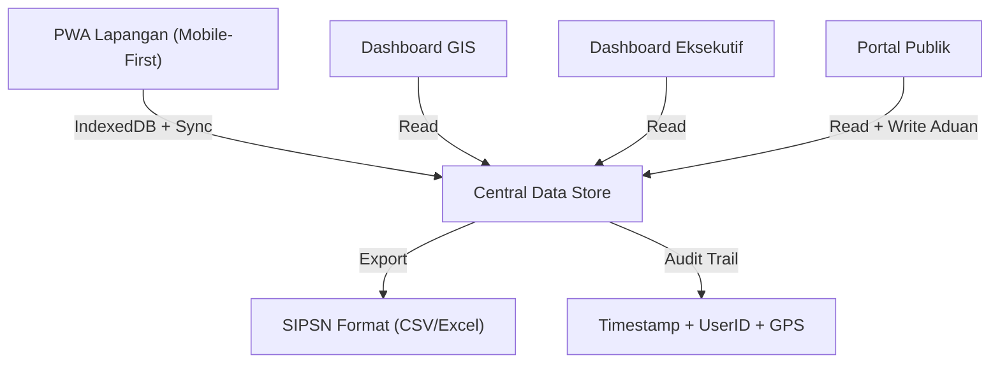
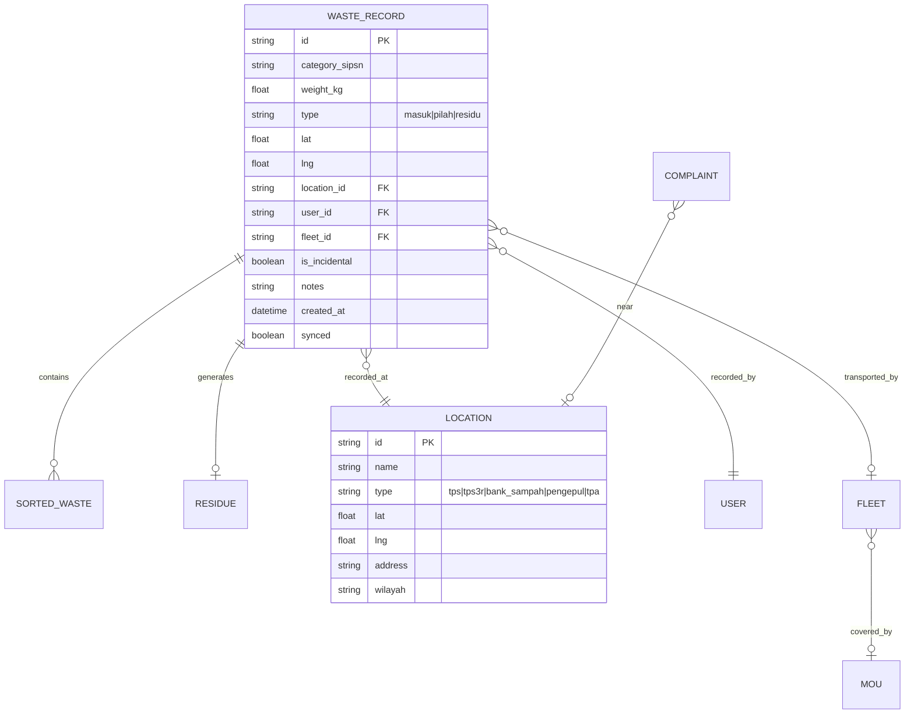

# Diagram SIMPAH

Berikut adalah diagram arsitektur dan model data untuk proyek SIMPAH. Anda dapat melihatnya secara langsung di bawah ini atau menekan klik-kanan dan **"Save Image As"** untuk mengekspor (menyimpan) gambarnya.

## 1. Architecture Overview
Diagram ini menunjukkan bagaimana PWA Lapangan (Mobile-First) berinteraksi secara offline-first dengan IndexedDB, serta aliran data ke dashboard, portal publik, dan sistem ekspor.

## 2. Data Model (SIPSN Compatible)
Diagram Entity-Relationship yang memodelkan relasi antar record pengelolaan sampah yang tersimpan secara lokal dan sudah kompatibel dengan format laporan nasional (SIPSN).

